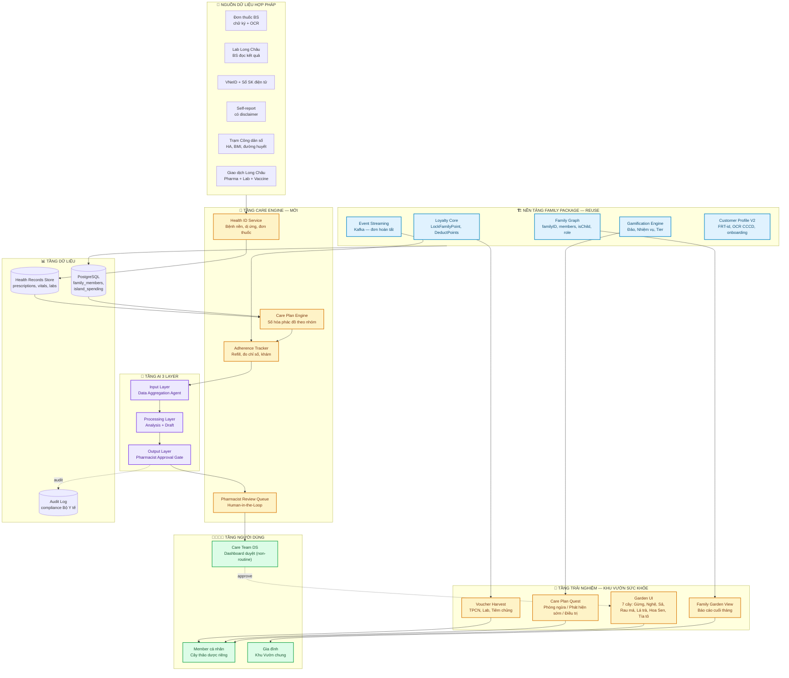
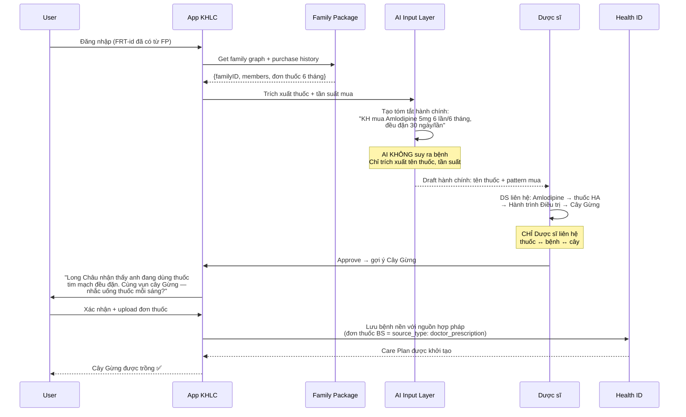
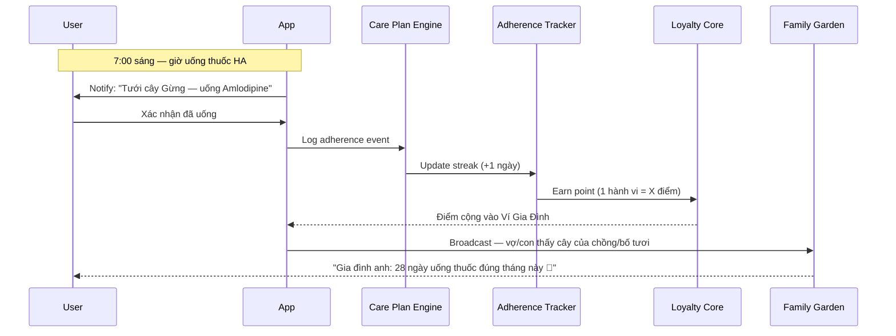
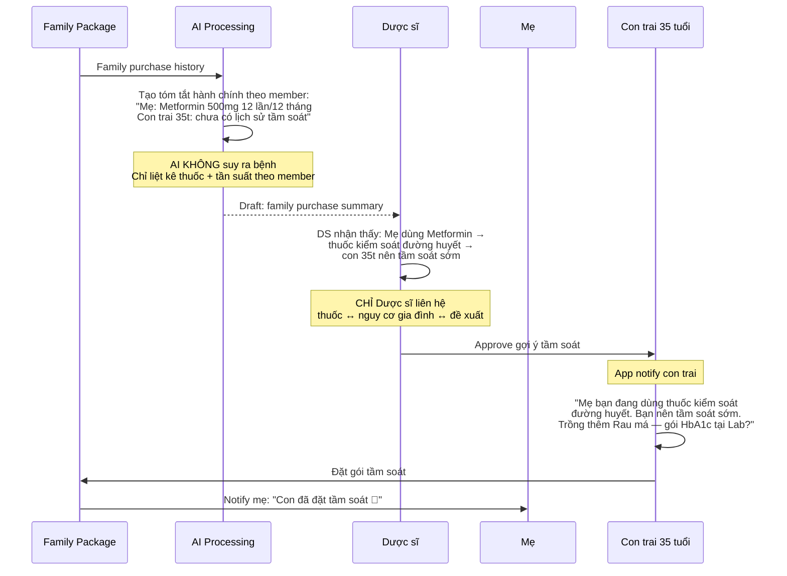
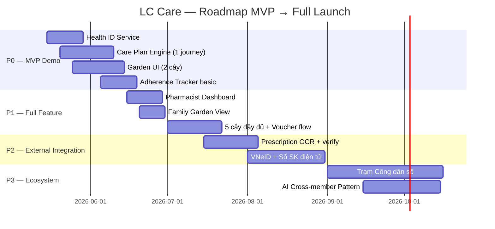
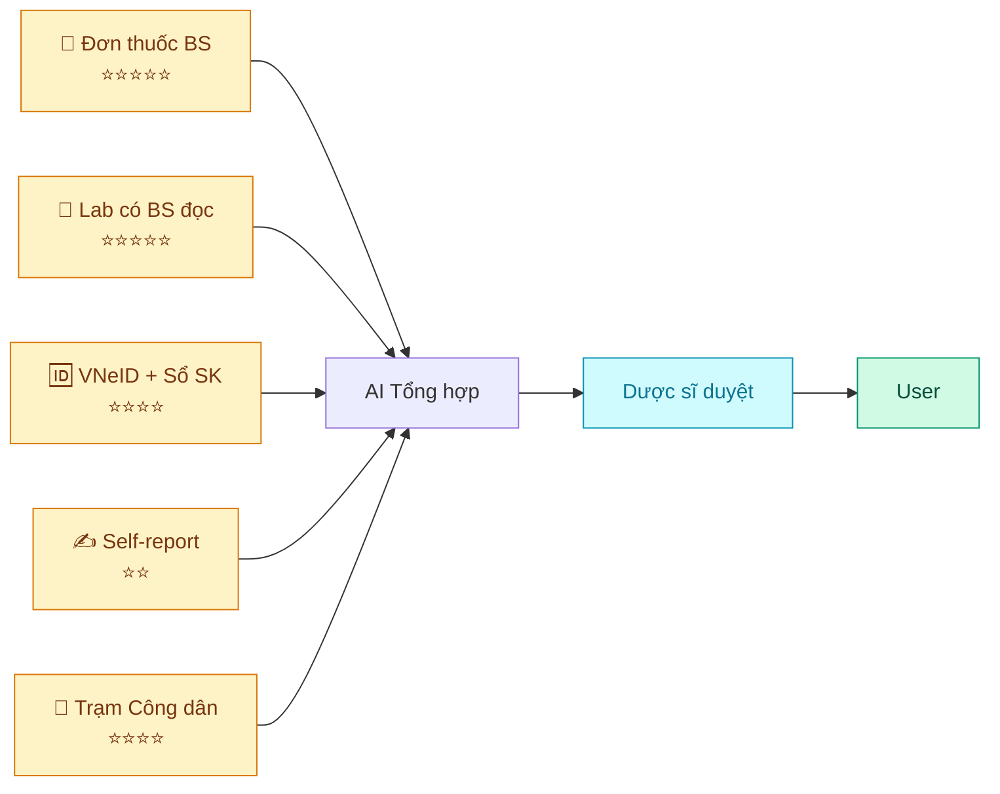

# LONG CHÂU CARE — SOLUTION DESIGN

> **Mục đích**: Tài liệu present thiết kế giải pháp cho cuộc thi  
> **Tagline**: *"Thức tỉnh sức khỏe — Dẫn lối đổi mới"*  
> **Phiên bản**: v1.0 · 2026-05-12  
> **Nền tảng mở rộng**: Family Package (FP) hiện tại của chuỗi Nhà Thuốc Long Châu

---

## 1. TÓM TẮT GIẢI PHÁP (Executive Summary)

**Long Châu Care** biến App KHLC từ **"kênh giao dịch"** thành **"bạn đồng hành sức khỏe gia đình"** thông qua ẩn dụ **Khu Vườn Thảo Dược Việt** — nơi mỗi thói quen chăm sóc bản thân là một cây thảo dược lớn lên, cả gia đình cùng vun trồng, Dược sĩ Long Châu đồng hành.

**Chiến lược kỹ thuật**: Tận dụng ~65% hạ tầng Family Package hiện có (Family graph, Loyalty pool, Gamification, Event streaming) + bổ sung 3 khối mới (Health ID, AI/Care Team Layer, Compliance Framework).

**Mô hình vận hành**: 70% output routine (nhắc lịch, refill, streak) auto-send bằng template cố định. 30% non-routine (onboarding, OCR verify, urgent) qua Care Team trung tâm (5-10 DS chuyên trách online). DS tại 3,000 nhà thuốc = zero impact.

**Moat độc quyền so với app health online thuần (Apple Health, Google Fit)**:
1. Lịch sử giao dịch y tế thực (mua thuốc, Lab, Tiêm chủng)
2. Trạm Công dân số (sensor đo chỉ số vật lý)
3. Ví Sức Khỏe gia đình (đã có từ FP)
4. Dược sĩ Long Châu Human-in-the-Loop

---

## 2. SƠ ĐỒ TỔNG QUAN KIẾN TRÚC (High-Level Architecture)



**Chú thích màu**:
- 🟦 **Xanh**: Tận dụng lại từ Family Package (ĐÃ CÓ)
- 🟨 **Vàng**: Xây mới cho LC Care
- 🟪 **Tím**: AI Layer — Human-in-the-Loop
- 🟩 **Xanh lá**: Người dùng

---

## 3. KIẾN TRÚC LUỒNG NGHIỆP VỤ (End-to-End Flow)

### 3.1. Luồng Onboarding — Trồng cây đầu tiên



### 3.2. Luồng Daily Care — Tưới cây hàng ngày



### 3.3. Luồng Cross-member Pattern — Vườn gia đình hiểu nhau



---

## 4. BÓC TÁCH COMPONENT (Component Breakdown)

### 4.1. Reuse từ Family Package (🟦)

| Component | Source FP | LC Care dùng cho | Effort |
|---|---|---|---|
| **Family Graph** | `family_members`, `familyID`, `isChild`, `role` | Khu vườn gia đình, cross-member | 🟢 0% — reuse as-is |
| **Loyalty Core** | `LockFamilyPointAsync`, `DeductPointsForFamilyPackageAsync` | Voucher thu hoạch, điểm từ hành vi | 🟡 20% — thêm event source |
| **Gamification** | Đảo, Nhiệm vụ, Tier | Care Quest, Cây thảo dược | 🟡 30% — thêm cơ chế cây |
| **Event Streaming** | Kafka: đơn hoàn tất | Trigger adherence tracker | 🟡 15% — thêm topic mới |
| **Customer Profile V2** | FRT-id, OCR CCCD, onboarding flow | Health ID onboarding | 🟢 5% — mở rộng schema |
| **ZNS + Template engine** | Notification FP | Nhắc thuốc, nhắc tiêm | 🟢 10% — thêm template |

### 4.2. Build mới cho LC Care (🟨)

| Component | Mô tả | Độ phức tạp | MVP? |
|---|---|---|---|
| **Health ID Service** | Lưu bệnh nền, dị ứng, đơn thuốc với nguồn hợp pháp | 🔴 High | ✅ P0 |
| **Care Plan Engine** | Số hóa 3 phác đồ: Phòng ngừa / Phát hiện sớm / Điều trị | 🔴 High | ✅ P0 |
| **Adherence Tracker** | Theo dõi refill, đo chỉ số, khám định kỳ | 🟡 Medium | ✅ P0 |
| **Garden UI** | 7 cây thảo dược, animation, pause/graduated logic | 🟡 Medium | ✅ P0 |
| **Care Team Dashboard** | Queue duyệt non-routine items + auto-approve audit trail | 🟡 Medium | ✅ P1 |
| **Family Garden View** | Báo cáo tháng, social loop gia đình | 🟢 Low | ✅ P1 |
| **Family Calendar Concierge** | AI tổng hợp lịch tuần gia đình + CTA batching | 🟡 Medium | ✅ P1 |
| **Prescription OCR + verify** | Upload đơn thuốc, OCR + DS xác thực nguồn | 🔴 High | ✅ P0 (MVP) |
| **VNeID Integration** | Pull lịch sử y tế từ Sổ SK điện tử | 🔴 High | 🟡 P2 |
| **Trạm Công dân số** | Kiosk đo HA, BMI → sync app | 🔴 High | 🟡 P3 |

### 4.3. AI Layer (🟪) — 3 tầng Human-in-the-Loop

| Tầng | Vai trò | KHÔNG được làm |
|---|---|---|
| **Input Layer** (Data Agent) | Gom data, tạo bản tóm tắt sức khỏe | Không suy luận bệnh |
| **Processing Layer** (Analysis) | Tạo draft cảnh báo, gợi ý hành chính | Không push trực tiếp |
| **Output Layer** (Human Gate) | Routine template → auto-send. Non-routine → Care Team DS approve → mới đến user | AI không tự output y tế. DS tại quầy không bị ảnh hưởng |

---

## 5. DATA MODEL MỞ RỘNG

### 5.1. Bảng mới cần thêm

```sql
-- Health ID: lưu bệnh nền với nguồn hợp pháp
CREATE TABLE health_conditions (
  id UUID PRIMARY KEY,
  customer_id VARCHAR(64) NOT NULL,  -- FRT-id từ FP
  condition_code VARCHAR(20),         -- ICD-10 nếu có
  condition_name VARCHAR(200),
  source_type ENUM('doctor_prescription', 'lab_with_doctor', 
                   'vneid', 'self_report', 'citizen_station'),
  source_reference VARCHAR(500),      -- link tới doc/ảnh đơn
  verified_by VARCHAR(64),            -- Dược sĩ ID nếu đã duyệt
  status ENUM('pending', 'verified', 'expired'),
  created_at TIMESTAMP,
  INDEX idx_customer (customer_id)
);

-- Care Plan: phác đồ số hóa
CREATE TABLE care_plans (
  id UUID PRIMARY KEY,
  customer_id VARCHAR(64),
  family_id VARCHAR(64),              -- reuse từ FP
  journey_type ENUM('prevention', 'early_detection', 'treatment', 'maternity', 'pediatric'),
  plant_type ENUM('ginger', 'turmeric', 'lemongrass', 'gotu_kola', 'tea', 'lotus', 'perilla'),
  plant_level INT DEFAULT 1,
  plant_status ENUM('growing', 'mature', 'paused', 'graduated'),  -- KHÔNG có 'dead'
  pharmacist_approved BOOLEAN,
  created_at TIMESTAMP
);

-- Adherence Events: log mỗi hành vi
CREATE TABLE adherence_events (
  id UUID PRIMARY KEY,
  care_plan_id UUID REFERENCES care_plans(id),
  event_type ENUM('med_taken', 'vital_logged', 'checkup_done', 
                  'vaccine_done', 'refill_done'),
  evidence JSONB,                     -- ảnh, số liệu, timestamp
  points_earned INT,
  created_at TIMESTAMP
);

-- Pharmacist Review Queue: AI draft chờ duyệt
CREATE TABLE pharmacist_review_queue (
  id UUID PRIMARY KEY,
  draft_type ENUM('onboarding_suggestion', 'adherence_alert', 
                  'cross_member_pattern', 'medication_interaction'),
  ai_draft JSONB,                     -- nội dung AI tạo
  target_customer_id VARCHAR(64),
  status ENUM('pending', 'approved', 'rejected', 'edited'),
  reviewed_by VARCHAR(64),
  reviewed_at TIMESTAMP,
  final_output JSONB                  -- sau khi DS edit
);

-- Audit Log: compliance Bộ Y tế
CREATE TABLE medical_audit_log (
  id UUID PRIMARY KEY,
  action_type VARCHAR(100),
  actor_type ENUM('ai', 'pharmacist', 'doctor', 'user', 'system'),
  actor_id VARCHAR(64),
  target_customer_id VARCHAR(64),
  payload JSONB,
  source_chain VARCHAR(100),          -- trace về nguồn hợp pháp
  created_at TIMESTAMP
);

-- Prescriptions: OCR + Pharmacist Verification
CREATE TABLE prescriptions (
  id UUID PRIMARY KEY,
  customer_id VARCHAR(64),
  image_url VARCHAR(500),
  ocr_raw_text TEXT,
  ocr_confidence DECIMAL(3,2),
  extracted_fields JSONB,              -- {drugName, dose, frequency, duration} + source per field
  verification_status ENUM('ocr_pending', 'verified', 'rejected', 'manual_entry'),
  verified_by VARCHAR(64),             -- Dược sĩ ID
  verified_at TIMESTAMP,
  doctor_info JSONB,                   -- {name, hospital, licenseNumber}
  care_plan_id UUID REFERENCES care_plans(id),
  created_at TIMESTAMP
);

-- Family Calendar: weekly AI concierge
CREATE TABLE family_calendars (
  id UUID PRIMARY KEY,
  family_id VARCHAR(64),
  week_start DATE,
  week_end DATE,
  items JSONB[],                       -- [{date, member, journey, activity, location, batchableWith}]
  ai_summary TEXT,
  ai_cta TEXT,
  pharmacist_approved BOOLEAN,
  pushed_at TIMESTAMP,
  created_at TIMESTAMP
);
```

### 5.2. Bảng reuse từ FP (không đổi)

| Bảng | Giữ nguyên | Chỉ bổ sung |
|---|---|---|
| `family_members` | ✅ | — |
| `island_spending` | ✅ | Thêm field `health_mission_pass` (optional) |
| `loyalty_points` | ✅ | — |
| `family_missions` | ✅ | Thêm mission type `health_adherence` |

---

## 6. TECH STACK

> **Quan trọng**: Stack dưới đây là **production target** (sau MVP demo).
> Demo cuộc thi dùng **Firebase/Google Cloud** (chi tiết: `LC_CARE_FULL_PLAN.md`).
> Presentation Slide 5 có bảng Demo vs Production đầy đủ.

| Layer | Production (FP-aligned) | Demo (Firebase/Google) |
|---|---|---|
| **Mobile App** | App KHLC hiện tại (React Native) + Garden module | PWA (HTML+JS, single-page) |
| **API Gateway** | API V2 hiện có + `/lc-care/*` endpoints | Firebase Functions HTTP + Callable |
| **Care Engine** | NestJS + TypeScript microservice mới | Firebase Functions (Node.js 20, 6 functions) |
| **AI Layer** | Python + LLM (Azure OpenAI / internal) | Gemini Flash + Cloud Vision |
| **Database** | PostgreSQL (reuse FP) + schema `lc_care` | Firestore (NoSQL doc) |
| **Event Bus** | Kafka (reuse FP) + topics mới | Firebase Triggers (onCreate/onCall) |
| **Pharmacist Dashboard** | Next.js internal portal | Tích hợp trong PWA (1 screen) |
| **Storage** | S3 (reuse FP) | Firebase Storage |
| **Push Notification** | ZNS + Template engine (FP reuse) | Firebase Cloud Messaging |

---

## 7. ROADMAP TRIỂN KHAI (Theo độ ưu tiên)



### MVP cho Demo (4-6 tuần)
**Scope tối thiểu đủ để present**:
1. ✅ 1 hành trình (Điều trị — cây Gừng)
2. ✅ Onboarding AI gợi ý từ lịch sử mua thuốc FP
3. ✅ Dược sĩ duyệt → user xác nhận
4. ✅ Adherence tracker (uống thuốc daily)
5. ✅ Family garden view (share tới người thân)
6. ✅ Voucher harvest (reuse Loyalty)

---

## 8. COMPLIANCE & GUARDRAILS

### 8.1. 5 nguyên tắc tuyệt đối

| # | Nguyên tắc | Cơ chế đảm bảo |
|---|---|---|
| 1 | AI không tự chẩn đoán | Routine template auto-send. Non-routine output qua Care Team DS gate (5-10 DS chuyên trách) |
| 2 | Mọi bệnh lý phải có nguồn hợp pháp | `health_conditions.source_type` enforce 5 nguồn duy nhất |
| 3 | Cây không bao giờ chết | `plant_status` enum không có `'dead'`, chỉ `'paused'` hoặc `'graduated'` (cho journey có thời hạn như thai sản) |
| 4 | Voucher không dành cho thuốc kê đơn | Whitelist SKU: TPCN, bông băng, nước muối, dịch vụ Lab/Vac. Min order 150k |
| 5 | Data mã hóa theo Bộ Y tế | Encrypt at rest + audit log đầy đủ |
| 6 | Data Separation: Engagement ≠ Clinical | "Tưới cây" = DAU metric. Refill alert = từ purchaseHistory (FP transaction). Hai hệ độc lập |

### 8.2. 4 nguyên tắc thiết kế Khu Vườn

1. **Cây lớn nhờ HÀNH VI, không nhờ chỉ số** → reward adherence, không judge kết quả
2. **Cây ngủ đông, không chết** → không tạo cảm giác tội lỗi y khoa
3. **Phần thưởng an toàn** → whitelist strict, min order 150k
4. **Vườn gia đình, không cá nhân** → tận dụng FP family graph
5. **Farm-Friendly** → cứ để user farm điểm (50k/30 ngày = CAC 1,667đ/ngày, 30x brand recall)
6. **CTA Priority Stack** → Rx refill (Primary) trước TPCN voucher (Secondary) — Health-First + cross-sell
7. **Progressive Onboarding** → Self-report → Lifestyle cây auto. Đơn thuốc → Clinical cây qua DS. Max 3 cây active

---

## 9. SUCCESS METRICS (OKR)

### 9.1. Mục tiêu chính

| KPI | Baseline | Target | Cơ chế đo |
|---|---|---|---|
| DAU | Hiện tại | +40% YoY | App analytics |
| D30 retention | 35% | 55% | Cohort analysis |
| Tần suất mua/tháng | 1.8x | 3.2x | Transaction log |
| NPS | Hiện tại | +20 điểm | Survey in-app |

### 9.2. Mục tiêu Khu Vườn

| KPI | Target | Ý nghĩa |
|---|---|---|
| Family-link rate | ≥ 40% | % user có ≥2 thành viên gia đình trong app |
| Garden DAU | ≥ 30% | % Khu Vườn user mở app daily để "tưới cây" |
| Adherence streak ≥7d | ≥ 25% | % user duy trì tuân thủ tuần |
| Care Team approval turnaround | ≤ 2h | SLA duyệt non-routine items bởi Care Team DS |

---

## 10. RỦI RO & GIẢM THIỂU

| Rủi ro | Mức độ | Giảm thiểu |
|---|---|---|
| AI hallucinate → sai chẩn đoán | 🔴 Critical | Human-in-the-Loop bắt buộc, Output Layer có gate |
| DS tại quầy workload concern | ✅ Solved | Care Team trung tâm (5-10 DS chuyên trách) + 70% auto-approve routine. DS tại quầy = zero impact |
| User không muốn chia sẻ data y tế | 🟡 Medium | Value exchange rõ ràng, progressive disclosure |
| Compliance Bộ Y tế thay đổi | 🟡 Medium | Audit log đầy đủ, architect có compliance officer |
| FP core bị ảnh hưởng khi extend | 🟢 Low | LC Care là service riêng, chỉ consume FP events |

---

## 11. DIFFERENTIATOR — VÌ SAO LC CARE THẮNG?

| Đối thủ | Thiếu gì so với LC Care |
|---|---|
| **Apple Health / Google Fit** | Không có family wallet, không có transaction y tế thực, không có pharmacist HITL |
| **App online thuần** (Jio, Medigo...) | Không có sensor vật lý (Trạm), không có 3 chuỗi thật (Pharma+Lab+Vaccine) |
| **App bệnh viện** | Không gamify, không family-centric, chỉ chăm 1 khía cạnh |
| **FP hiện tại** | Chưa có health identity, chỉ là loyalty đơn thuần |

**Câu chốt cho presentation**:
> *"Long Châu không bán thuốc. Long Châu vun một khu vườn sức khỏe cho từng gia đình Việt — nơi mỗi thói quen tốt là một cây thảo dược, cả nhà cùng chăm, Dược sĩ đồng hành."*

---

## 12. LEGAL COMPLIANCE ALIGNMENT

> **Tham chiếu đầy đủ**: [`docs/legal-compliance.md`](docs/legal-compliance.md) — 10 văn bản pháp luật được đối chiếu.
> Mọi quyết định kiến trúc dưới đây đều map về quy định pháp luật Việt Nam.

### 12.1. Mapping: Architecture Decision → Law

| # | Architecture Decision | Căn cứ pháp lý | Section trong Solution Design |
|---|---|---|---|
| 1 | AI KHÔNG chẩn đoán — chỉ tạo draft hành chính | Luật KCB 2023, Điều 3 | Section 8.1, Guardrail #1 |
| 2 | Non-routine message y tế qua Care Team DS gate | Luật KCB 2023, Điều 100 | Section 3.1 (Onboarding), Section 4.3 (AI Layer) |
| 3 | 5 nguồn dữ liệu hợp pháp (`source_type` enum) | Luật KCB 2023, Điều 19 | Section 5.1 (health_conditions), Phụ lục B |
| 4 | Cây không bao giờ chết (`paused`/`graduated`) | Đạo đức y khoa — không tạo cảm giác tội lỗi | Section 8.1, Guardrail #3 |
| 5 | Voucher whitelist (không thuốc kê đơn) | Luật Dược 2016, Điều 79 | Section 8.1, Guardrail #4 |
| 6 | AES-256 + TLS 1.3 + Audit log | Nghị định 13/2023/NĐ-CP, Điều 12 | Section 8.1, Guardrail #5 |
| 7 | PharmacistLiabilitySignature (chữ ký điện tử) | Thông tư 46/2018/TT-BYT | Section 5.1 (pharmacist_review_queue) |
| 8 | Consent granular — opt-in từng loại data | Nghị định 13/2023/NĐ-CP, Điều 11-15 | Section 1 (Value Exchange) |
| 9 | Medical audit log immutable — lưu 10 năm | TT 46/2018/TT-BYT + Luật KCB 2023 | Section 5.1 (medical_audit_log) |
| 10 | DS có CCHN — đăng ký tại Sở Y tế | Luật Dược 2016, Điều 11 + NĐ 96/2023 | Section 8.1, Guardrail #2 |

### 12.2. AI Liability Chain (Điều 100 Luật KCB 2023)

```
User nhận message
     ↑
     │ 5. Final output — pharmacistLiabilitySignature
     │
Dược sĩ approve (PRIMARY LIABLE)
     ↑
     │ 4. pharmacistEditedResponse + pharmacistApprovedAt
     │
AI tạo draft (SECONDARY ACTOR — không phải pháp nhân)
     ↑
     │ 3. aiDraft + aiBrief + contextSnapshot
     │
Input data từ nguồn hợp pháp
     ↑
     │ 2. health_conditions.source_type (5 nguồn)
     │    + source_reference (link ảnh đơn/phiếu xét nghiệm)
```

### 12.3. 5-Tier Architecture → Legal Compliance Map

| Tầng (GK yêu cầu) | LC Care Component | Luật chi phối |
|---|---|---|
| **Presentation** | PWA → React Native | NĐ 13/2023 (consent UI, data rights) |
| **Application** | 6 Firebase Functions | Luật Dược 2016 + Luật KCB 2023 (DS gate) |
| **AI/ML** | Input → Processing → Output (Human Gate) | Luật KCB 2023 (no AI diagnosis) |
| **Data** | Firestore + PostgreSQL + Audit Log | NĐ 13/2023 + TT 46/2018 (encrypt, retention) |
| **Infrastructure** | Firebase + Google Cloud + FP Cloud | NĐ 13/2023 (data localization considerations) |

### 12.4. 6 Design Principles → Compliance Evidence

| # | Nguyên tắc | Evidence trong Solution Design |
|---|---|---|
| 1 | **Health-First** | Rule #0 (agents.md) + Section 8.1 Guardrail #1 |
| 2 | **Privacy by Design** | Section 1 (Value Exchange) + Section 5.1 (health_conditions) + NĐ 13/2023 |
| 3 | **AI Augments, Never Replaces** | Section 4.3 (AI Layer) — 3 tầng, output có gate |
| 4 | **Auditability** | Section 5.1 (medical_audit_log) + Section 4.3 (Output Layer) |
| 5 | **Fail Safe** | Section 8.1 Guardrail #3 (plant never dies) + OCR fallback (P2) |
| 6 | **MECE Ownership** | Section 4.3 (phân vai AI vs DS) + RACI matrix (presentation slide 14) |

### 12.5. RACI Matrix — 7 Quyết Định Quan Trọng

| Decision | Responsible | Accountable | Consulted | Informed |
|---|---|---|---|---|
| AI output wording | AI System | **Dược sĩ** | Product Owner | User |
| Gán cây thảo dược | AI (draft) | **Dược sĩ** | — | User |
| Tạo Care Plan | Dược sĩ | **DS trưởng** | BS (nếu cần) | User |
| Cảnh báo tương tác thuốc | AI System | **Dược sĩ** | — | User |
| Voucher whitelist | Dev Team | **Product Owner** | Legal Team | User |
| Data sharing với bên thứ 3 | — | **DPO** | Legal Team | User |
| Thay đổi Care Plan logic | Dev Team | **Product Owner** | DS trưởng | User |

### 12.6. Pre-Launch Compliance Checklist

- [ ] Privacy Impact Assessment (PIA) — NĐ 13/2023
- [ ] Data Processing Agreement (DPA) with Google Cloud
- [ ] Consent flow legal review
- [ ] Pharmacist training (4 modules, 100% completion)
- [ ] Penetration testing (independent auditor)
- [ ] Data retention policy documented (10-year medical records)
- [ ] Incident response plan (Detect → Contain → Notify → Remediate)
- [ ] DPO (Data Protection Officer) appointed

---

## PHỤ LỤC A — MAPPING FP → LC CARE

| FP Concept | LC Care Concept | Mức reuse |
|---|---|---|
| Đảo (Island) | Mùa vụ của khu vườn | 100% cơ chế |
| Nhiệm vụ (Mission) | Quest cho cây | 80% cơ chế + thêm health mission |
| Chi tiêu (Spending) | Adherence behavior | Cơ chế tương tự, source khác |
| Tier gia đình | Tier khu vườn | 100% cơ chế |
| Voucher đổi quà | Voucher thu hoạch | 100% cơ chế + whitelist mới |
| Family leader | Người chăm vườn chính | 100% concept |
| isChild flag | Cây riêng cho trẻ | 100% reuse |

---

## PHỤ LỤC B — 5 NGUỒN DỮ LIỆU HỢP PHÁP



---

**Tài liệu này chỉ dùng nội bộ và cho cuộc thi. KHÔNG publish lên Confluence/Jira.**
