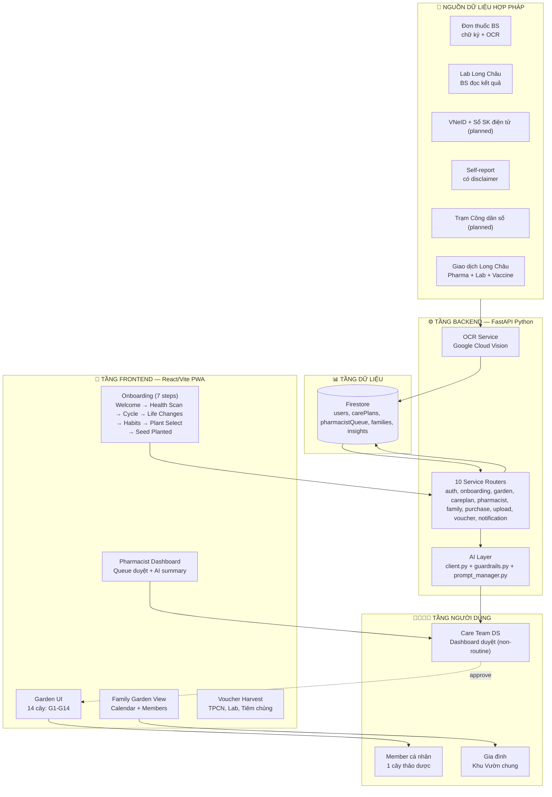

# LONG CHÂU CARE — SOLUTION DESIGN v2

> **Mục đích**: Tài liệu present thiết kế giải pháp cho cuộc thi
> **Tagline**: *"Thức tỉnh sức khỏe — Dẫn lối đổi mới"*
> **Phiên bản**: v2.0 · 2026-05-18
> **Stack**: FastAPI Python + React/Vite PWA + Firebase Firestore + Google Cloud
> **Plant System**: 14 nhóm cây (G1-G14), mỗi người 1 cây

---

## 1. TÓM TẮT GIẢI PHÁP (Executive Summary)

**Long Châu Care** biến App KHLC từ **"kênh giao dịch"** thành **"bạn đồng hành sức khỏe gia đình"** thông qua ẩn dụ **Khu Vườn Thảo Dược Việt** — nơi mỗi thói quen chăm sóc bản thân là một cây thảo dược lớn lên, cả gia đình cùng vun trồng, Dược sĩ Long Châu đồng hành.

**Chiến lược kỹ thuật**: FastAPI Python backend (10 services) + React/Vite PWA frontend + Firebase Firestore + Google Cloud Vision OCR + Gemini Flash AI.

**Mô hình vận hành**: 70% output routine (nhắc lịch, refill, streak) auto-send bằng template cố định. 30% non-routine (onboarding Medical Groups, OCR verify, urgent) qua Care Team trung tâm (5-10 DS chuyên trách online). DS tại 3,000 nhà thuốc = zero impact.

**Moat độc quyền so với app health online thuần (Apple Health, Google Fit)**:
1. Lịch sử giao dịch y tế thực (mua thuốc, Lab, Tiêm chủng)
2. Trạm Công dân số (sensor đo chỉ số vật lý)
3. Ví Sức Khỏe gia đình
4. Dược sĩ Long Châu Human-in-the-Loop

---

## 2. SƠ ĐỒ TỔNG QUAN KIẾN TRÚC (High-Level Architecture)



---

## 3. KIẾN TRÚC 5 TẦNG

```
┌──────────────────────────────────────────────────┐
│ PRESENTATION — React/Vite PWA                     │
│ 13 màn hình, mobile-first, REST API calls         │
├──────────────────────────────────────────────────┤
│ APPLICATION — FastAPI Python Backend              │
│ 10 service routers + AI layer + OCR               │
├──────────────────────────────────────────────────┤
│ AI/ML — 3-Layer Smart Gate                        │
│ 70% Routine Auto-send + 30% Care Team Gate        │
│ Gemini Flash + guardrails.py (banned patterns)    │
├──────────────────────────────────────────────────┤
│ DATA — Firestore                                  │
│ users, carePlans, pharmacistQueue, families       │
├──────────────────────────────────────────────────┤
│ INFRASTRUCTURE — Firebase + Google Cloud          │
│ Firebase Auth, Hosting, Firestore + Cloud Vision  │
└──────────────────────────────────────────────────┘
```

---

## 4. HỆ THỐNG CÂY — 14 NHÓM (G1-G14)

Mỗi người dùng được gán **đúng 1 cây** dựa trên rule-based assignment. Sau khi cây trưởng thành, có thể mở thêm cây mới.

### 14 Nhóm Cây

| Group | Cây           | Emoji | Hành trình                  | DS duyệt? |
| ----- | ------------- | ----- | --------------------------- | --------- |
| G1    | Bạc Hà      | 🌿    | Default / Khỏe mạnh      | Không     |
| G2    | Gừng         | 🫚    | Theo dõi chỉ số (HA)     | **Có**    |
| G3    | Khổ Qua      | 🥒    | Mãn tính (Tiểu đường)    | **Có**    |
| G4    | Sen           | 🪷    | Thai sản / Sau sinh       | Không     |
| G5    | Húng Quế    | 🌿    | Trẻ em / Thanh thiếu niên | Không     |
| G6    | Lô Hội       | 🪴    | Người cao tuổi (60+)      | Không     |
| G7    | Nghệ         | 🟡    | Hồi phục / Viêm          | **Có**    |
| G8    | Oải Hương   | 🪻    | Sức khỏe tinh thần       | **Có**    |
| G9    | Nhân Sâm     | 🥔    | Vận động tích cực         | Không     |
| G10   | Rau Má       | 🌾    | Ít vận động               | Không     |
| G11   | Cam Thảo     | 🌿    | Chăm sóc gia đình         | Không     |
| G12   | Sả           | 🌿    | Thanh lọc / Vận động      | Không     |
| G13   | Đỗ Trọng    | 🌳    | Xương khớp                 | **Có**    |
| G14   | Diệp Hạ Châu | 🌿    | Tiêu hóa / Gan            | **Có**    |

### Rule-Based Assignment Algorithm

```
Priority 1 — Medical (cần DS duyệt):
  chronic + diabetes     → G3  (Khổ Qua)
  chronic + hypertension → G2  (Gừng)
  chronic + cholesterol  → Tea (future)
  chronic + bone_joint   → G13 (Đỗ Trọng)
  chronic + digestive    → G14 (Diệp Hạ Châu)
  mental                 → G8  (Oải Hương)
  recovery               → G7  (Nghệ)
  monitoring             → G2  (Gừng)

Priority 2 — Life Stage:
  age < 18               → G5  (Húng Quế)
  age ≥ 60              → G6  (Lô Hội)
  pregnant               → G4  (Sen)

Priority 3 — Lifestyle:
  exercise = active      → G9  (Nhân Sâm)
  careFor = family       → G11 (Cam Thảo)
  exercise = sedentary   → G10 (Rau Má)

Default → G1 (Bạc Hà)
```

### Medical Groups — Quy trình duyệt

1. User submit onboarding → hệ thống gán cây (rule-based)
2. Nếu cây thuộc Medical Group (G2, G3, G7, G8, G13, G14) → Care Plan status = `pending`
3. Item được đẩy vào `pharmacistQueue` với AI summary
4. Care Team DS xem xét → approve hoặc đổi cây
5. Sau khi DS approve → Care Plan kích hoạt, cây chuyển `growing`

Non-medical groups → auto-approve, cây kích hoạt ngay sau onboarding.

---

## 5. ONBOARDING FLOW — 7 BƯỚC

```
Step 1: Welcome         — Giới tính, năm sinh, careFor
Step 2: Health Scan     — Health status + OCR upload + chronic sub-conditions
Step 3: Cycle Tracking  — Chu kỳ (chỉ nữ) — ngày bắt đầu, độ dài
Step 4: Life Changes    — Thay đổi cuộc sống gần đây
Step 5: Habits          — Mức độ vận động + thói quen cần cải thiện
Step 6: Plant Select    — Chọn cây ưu tiên (14 cây, rule-based suggestion)
Step 7: Seed Planted    — Submit hồ sơ → loading → AI summary + kết quả
                         ├── Medical Group → "Đã gửi Care Team, DS sẽ duyệt trong 2h"
                         └── Non-Medical  → "Cây đã được kích hoạt! Ghé thăm Khu Vườn"
```

---

## 6. BACKEND SERVICES — 10 ROUTERS

| Router        | Prefix              | Endpoints                                  |
| ------------- | ------------------- | ------------------------------------------ |
| Auth          | /api/auth           | Login, register, verify token              |
| Onboarding    | /api/onboarding     | POST /submit, GET /status/{userId}         |
| Garden        | /api/garden         | GET /, POST /water, GET /badges            |
| Care Plan     | /api/careplan       | GET / (list plans)                         |
| Pharmacist    | /api/pharmacist     | GET /queue (pending items)                 |
| Family        | /api/family         | GET /, GET /calendar                       |
| Purchase      | /api/purchase       | GET / (purchase history)                   |
| Upload        | /api/upload         | POST / (document upload + OCR)             |
| Voucher       | /api/voucher        | GET /, POST /redeem/{id}                   |
| Notification  | /api/notification   | POST / (send push)                         |
| AI            | /api/ai             | POST / (AI summary, insights)              |

---

## 7. AI GOVERNANCE — 3 LỚP CHẶN

```
LỚP 1 — Từ ngữ             LỚP 2 — Output Gate        LỚP 3 — Audit
───────────────────    ───────────────────────    ──────────────────
AI bị cấm dùng từ:      ROUTINE: auto-send         Mọi output của AI
"bị bệnh", "mắc",      (template cố định)          được ghi log
"chẩn đoán", "điều trị"  NON-ROUTINE: qua Care
                         Team DS approve
```

### Từ Cấm Tuyệt Đối (guardrails.py)

- `bị bệnh` / `mắc bệnh` / `bệnh nhân`
- `chẩn đoán` / `kết luận`
- `điều trị` (chỉ DS/BS được dùng)
- `phác đồ` / `đơn thuốc` (khi AI tự đề xuất)
- Đề xuất cây thảo dược cụ thể
- Suy luận di truyền/bệnh từ thuốc

### AI Role Matrix

| Vai trò                          | AI làm                    | Dược sĩ làm                   |
| -------------------------------- | ------------------------- | ----------------------------- |
| OCR trích xuất đơn thuốc       | Tự động                | Xác minh                      |
| Phát hiện pattern hành vi       | Tự động                | —                             |
| Suy ra bệnh từ thuốc            | **CẤM**              | Dược sĩ kết luận             |
| Đề xuất cây thảo dược          | **CẤM**              | Dược sĩ liên hệ thuốc↔bệnh↔cây |
| Tạo draft hành chính (refill)   | Có điều kiện          | Duyệt + sửa                  |
| Push message y tế tới user     | **CẤM** (trừ routine) | Care Team DS approve           |
| Tạo onboarding summary          | Được (có guardrails)     | Duyệt trước khi hiển thị     |

---

## 8. DATA SEPARATION — Engagement ≠ Clinical

```
"Tưới cây" (adherenceEvents)  = ENGAGEMENT metric
  → Chỉ dùng cho: streak, points, garden UI, DAU, retention
  → User farm điểm = OK (CAC 1,667đ/ngày)
  → KHÔNG dùng cho quyết định y tế

Lịch sử mua hàng (purchaseHistory)  = CLINICAL metric
  → Dùng cho: Refill alert, Care Team triage
  → Tính từ ngày xuất kho gần nhất
  → Data sạch 100%, không bị nhiễu bởi gamification
```

---

## 9. TECH STACK

| Layer        | Technology                                                |
| ------------ | --------------------------------------------------------- |
| Frontend     | React 18 + Vite, PWA, mobile-first                        |
| Backend      | FastAPI Python, Uvicorn, port 8000                        |
| AI/ML        | Gemini Flash (wording) + Google Cloud Vision (OCR)        |
| Database     | Firebase Firestore                                        |
| Auth         | Firebase Auth (email, Google, anonymous)                  |
| Hosting      | Firebase Hosting (frontend), Docker/Cloud Run (backend)   |
| Push         | Firebase Cloud Messaging (planned)                        |
| Cron         | Google Cloud Scheduler (planned)                          |
| Compliance   | Python guardrails.py (banned patterns + exact phrases)    |

---

## 10. COMPLIANCE

| Luật                              | Status                                                       |
| --------------------------------- | ------------------------------------------------------------ |
| Luật Khám chữa bệnh 2023        | AI không chẩn đoán. DS primary liable.                      |
| Luật Dược 2016                   | DS có CCHN. Voucher whitelist.                               |
| Nghị định 13/2023/NĐ-CP          | AES-256 + TLS 1.3. Consent granular.                         |
| Thông tư 46/2018/TT-BYT          | Medical audit log. Source tracking.                          |

---

## 11. ROADMAP

| Phase               | Timeline      | Deliverables                                                        |
| ------------------- | ------------- | ------------------------------------------------------------------- |
| **P0 — MVP Demo** | T5-6/2026     | 14 cây + Onboarding 7 steps + Garden UI + AI summary + Pharmacist queue |
| **P1 — Full**     | T7/2026       | Family Calendar AI CTA + Insight cards + Voucher enforcement + Scheduler |
| **P2 — External**  | T8/2026       | Prescription OCR full + VNeID + Sổ SK điện tử                    |
| **P3 — Ecosystem** | T9+/2026      | Trạm Công dân số + AI Cross-member Pattern + SLA escalation       |

---

*Long Châu Care — Mỗi gia đình Việt là một Khu Vườn Sức Khỏe.*
